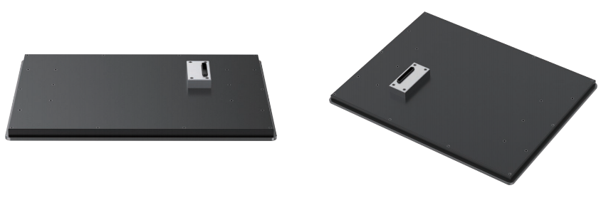

# 15.6" Modular Industrial Panel Based on NXP i.MX 8MPlus CPU
 

## Overview
The i.MX 8M Plus of applications processors combines scalable platforms with broad 
levels of integration and power-efficient processing capabilities. The modular panel 
provides flexible solutions based on quad core i.MX 8M Plus, targeted at both commercial and industrial applications.    
It consists of a front display screen and a back-end fanless computer, which allows 
customers to select the back-end module with an appropriate processor, and flexibly 
match it to a 10.1"/ 11.6"/ 15.6" touch screen. In this way, it helps to reduce time and 
cost in the future maintenance, upgrade and production process.

## Main Features
- Three touch screen sizes for options, including 10.1", 11.6" and 15.6"
- 2 x 10/100/1000Mbps RJ45 network, 2.4GHz & 5GHz Wi-Fi (4G optional)
- 4 x RS232, 2 x RS485/RS232, 4 x USB3.0 Host, 2 x USB2.0 Host
- 1 x HDMI, 1 x 3.5mm headphone

## Specification
| System  |             |
|----------|-----------------|
| CPU             | NXP i.MX 8M Plus (default), 4 x ARM Cortex-A53, comes with an integrated neural processing unit (NPU) that delivers up to 2.3 TOPS. Industrial grade CPU runs at 1.6GHz, and commercial grade CPU runs at up to 1.8GHz.(i.MX 8M Plus series CPU optional)           |
| Memory          | 2GB LPDDR4 (4GB/8GB optional) |
| Storage         | Onboard 16GB eMMC (8GB/32GB/64GB/128GB/256GB optional)                  |
| OS              | Yocto-L6.1.22_2.2.0, Ubuntu 22.04, Debian 12, Windows 10 IoT Enterprise (also supports Android, OpenWRT, FreeRTOS)   *Note: 4GB/8GB LPDDR4 supports Windows 10 IoT, recommend 8GB version.*|
|**Video & Audio**|               
| Touch Screen| 15.6" 1024 x 768 10-point capacitive touch screen (10.1"/11.6" screen optional) |
| Display Interface    | 1 x HDMI   |
| Audio Interface    | 1 x 3.5mm headphone |
|**Front I/O**|  
| Power Switch | 1 x Power switch |
| Power Input  | 1 x DC IN, supports 5.5mm x 2.1mm plug; 1 x 2Pin 3.81mm Phoenix |
| Network   | 2 x 10/100/1000Mbps RJ45 network port, 2.4GHz & 5GHz Wi-Fi4G (optional) |
| USB  | 4 x USB 3.0 Host Type-A |
| COM  | 2 x RS485/RS232 (RS485 for default) |
|**Rear I/O**|  
| COM | 4 x RS232 |
| USB  | 2 x USB 2.0 Host Type-A |
| Antenna Connectors | 1 x WIFI antenna connector, 1 x 4G antenna connector (optional) |
|**Mechanical & Environmental**|
| Enclosure | Black color, made of aluminum alloy |
| Dimension    | 261mm x 136mm x 39mm (Back-end computer module, not include the screen) |
| Weight  | 3.94kg |
| Cooling  | Fanless design, with radiator for heat dissipation  |
| Mounting  | VESA |
| Operating Temp. | Commercial: 0℃~+70℃ Extended Commercial: -20℃~+70℃ (default) Industrial: -40℃~+85℃  |

## Product Compliance and Safety
CE-EMC | CE-LVD | FCC   

## Industrial Panel Photos:

## Back-end Computer Photos:

## Other Panel Sizes for Options:

## Compatible with DEBIX's Accessories
| Product   | Model  |
|-------|------------|
| DEBIX Display Screens   | DEBIX TD050H; DEBIX TD070H; DEBIX TD101H |

## Safety Instructions:
***To aviod malfunction or damage to this product please observe the following:*** 
- Disconnect the device from the DC power supply before cleaning. Use a rag. Do not use liquid 
detergents or spray-on detergents.
- Keep the device away from moisture.
- During installation, put the device on a reliable table. It will be damaged if you drop it.
- Before connecting the power supply, ensure that the voltage is in the required range.
- Put the power cable in place to avoid stepping on it
- If the device is not used for a long time, power it off to avoid damage caused by sudden overvoltage.
- For safety reasons, the device can only be disassembled by professional personnel.
- Do not place the device outside the specified ambient temperature range. This will damage the machine. It needs to be kept in an environment at controlled temperature.

## Contact Us
- **Headquarters**: DEBIX Technology Inc., 8345 Gold River Ct., Las Vegas, NV 89113, USA  
- **Factory**: 5-6/F., East Zone, Shunheda A2 Building, Liqxiandong Industrial Park, XiLi, Nanshan Dist., Shenzhen, China  
- **Email**: info@debix.io  
- **Website**: [www.debix.io](https://www.debix.io)  
- **Community**: [Discord](https://discord.com/invite/adaHHaDkH2)

